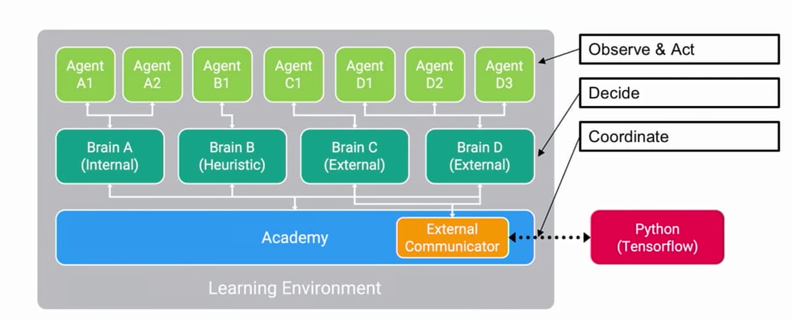
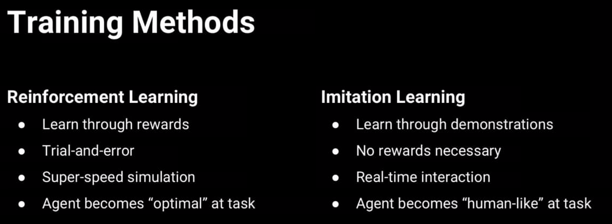
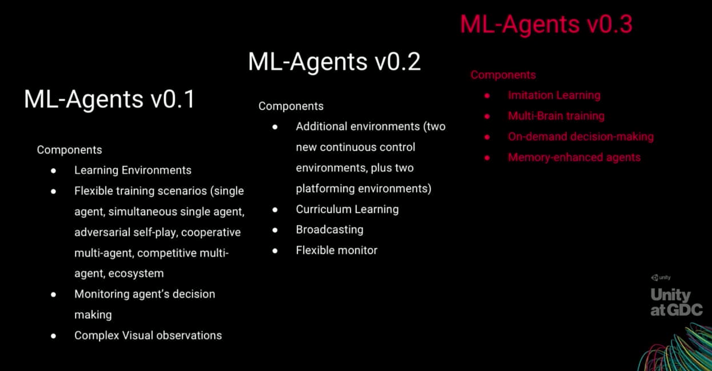

# Unity ML-Agents Hands-on
### 목표
[Making a New Learning Environment](https://github.com/Unity-Technologies/ml-agents/blob/master/docs/Learning-Environment-Create-New.md)을 같이 실습

### 준비
* [ml-agents](https://github.com/Unity-Technologies/ml-agents) clone 혹은 다운로드
(WSL로 clone후 windows에서 사용 안됨)
* [TensorflowSharpPlugin](https://s3.amazonaws.com/unity-ml-agents/0.4/TFSharpPlugin.unitypackage) 다운로드 혹은 설치

### ml-agents 설명


#### Academy
Training 환경과 Inference 환경이 어떻게 동작하는지 조절
시뮬레이션 속도, ... 설정
episode관리와 전체 environment reset 등을 관리

#### Brain
agent가 어떻게 동작해야 하는지 관리하며 agent에 대한 정보를 저장하지 않음
observation space, action space 정의
반드시 Academy의 자식이어야함
* Internal(실험)
* Heuristic
* External
* Player
이 외의 brain이 필요하면 CoreBrain을 직접 생성할 수 있음

#### Agent
환경을 관찰하고 동작을 수행하는 actor
기본 property
* Brain
* Visual Observation
* Max Step
* Reset On Done




(현재 버전은 0.4)


강화학습의 기본 구성

### 프로젝트 설명
Panel위에서 Sphere를 이동시켜 Box를 접촉하는 Agent를 강화학습을 통해 학습


### 작업 순서
0. 가상 환경 생성 및 python package 설치
0. 프로젝트 생성
0. GameObject를 배치해서 Modeling design(?)
0. Academy & Brain GameObject 생성
0. Academy & Brain 구현 및 적용
0. Agent 구현 및 적용
0. 실행 및 구현 상태 확인
0. 테스트 환경 구축 및 테스트
0. 학습
python learn.py --run-id=firstRun --train
python learn.py <project_name> --run-id=firstRun --train
0. 학습된 내용 Agent에 적용
python/trainer_conf.yaml
```
<brain_name>:
    <parameter1>: <value1>
    <parameter2>: <value2>
```
0. hyper parameter 조정
0. tensorboard 확인


### Agent code
```
using System.Collections;
using System.Collections.Generic;
using UnityEngine;
using MLAgents;
public class RollerAgent : Agent {
    public Transform target;
    Rigidbody myRigidbody;
    void Start()
    {
        myRigidbody = GetComponent<Rigidbody>();
    }
    public override void AgentReset()
    {
        if (this.transform.position.y < -1.0)
        {
            // The agent fell
            this.transform.position = Vector3.zero;
            this.myRigidbody.angularVelocity = Vector3.zero;
            this.myRigidbody.velocity = Vector3.zero;
        }
        else
        {
            // Move the target to a new spot
            target.position = new Vector3(Random.value * 8 - 4,
                                          0.5f,
                                          Random.value * 8 - 4);
        }
        // base.AgentReset();
    }
    public override void CollectObservations()
    {
        // Calculate relative position
        Vector3 relativePosition = target.position - this.transform.position;
        // Relative position
        AddVectorObs(relativePosition.x / 5);
        AddVectorObs(relativePosition.z / 5);
        // Distance to edges of platform
        AddVectorObs((this.transform.position.x + 5) / 5);
        AddVectorObs((this.transform.position.x - 5) / 5);
        AddVectorObs((this.transform.position.z + 5) / 5);
        AddVectorObs((this.transform.position.z - 5) / 5);
        // Agent velocity
        AddVectorObs(myRigidbody.velocity.x / 5);
        AddVectorObs(myRigidbody.velocity.z / 5);
    }
    public float speed = 10;
    private float previousDistance = float.MaxValue;
    public override void AgentAction(float[] vectorAction, string textAction)
    {
        // Rewards
        float distanceToTarget = Vector3.Distance(this.transform.position,
                                                  target.position);
        // Reached target
        if (distanceToTarget < 1.42f)
        {
            AddReward(2.0f);
            Done();
        }
        // Getting closer
        if (distanceToTarget < previousDistance)
        {
            AddReward(0.1f);
        }
        // Time penalty
        AddReward(-0.05f);
        // Fell off platform
        if (this.transform.position.y < -1.0)
        {
            AddReward(-4.0f);
            Done();
        }
        previousDistance = distanceToTarget;
        // Actions, size = 2
        Vector3 controlSignal = Vector3.zero;
        controlSignal.x = vectorAction[0];
        controlSignal.z = vectorAction[1];
        myRigidbody.AddForce(controlSignal * speed);
    }
}
```

### trainer_config.yaml
```
Brain:
    max_steps: 2.0e5
    normalize: true
    num_layers: 3
    hidden_units: 256
```
